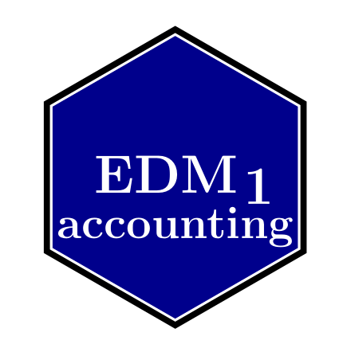

# Install

-> git clone https://github.com/julienlargetpiet/edm1.accounting

-> cd edm1

edm1 > R

R > library("devtools")

R > build()

R > install()

# `cost_and_taxes`

cost_and_taxes


## Description

Allow to calculate basic variables related to cost and taxes from a bunch of products (elements). So put every variable you know in the following order:


## Usage

```r
cost_and_taxes(
  qte = NA,
  pu = NA,
  prix_ht = NA,
  tva = NA,
  prix_ttc = NA,
  prix_tva = NA,
  pu_ttc = NA,
  adjust = NA,
  prix_d_ht = NA,
  prix_d_ttc = NA,
  pu_d = NA,
  pu_d_ttc = NA
)
```


## Arguments

Argument      |Description
------------- |----------------
`qte`     |     is the quantity of elements
`pu`     |     is the price of a single elements without taxes
`prix_ht`     |     is the duty-free price of the whole set of elements
`tva`     |     is the percentage of all taxes
`prix_ttc`     |     is the price of all the elements with taxes
`prix_tva`     |     is the cost of all the taxes
`pu_ttc`     |     is the price of a single element taxes included
`adjust`     |     is the discount percentage
`prix_d_ht`     |     is the free-duty price of an element after discount
`prix_d_ttc`     |     is the price with taxes of an element after discount
`pu_d`     |     is the price of a single element after discount and without taxes
`pu_d_ttc`     |     is the free-duty price of a single element after discount


## Examples

```r
print(cost_and_taxes(pu=45, prix_ttc=2111, qte=23))

# [1]   23.000000   45.000000   45.000000    1.039614 2111.000000 1076.000000
#[7]   45.000000          NA          NA          NA          NA          NA
```


